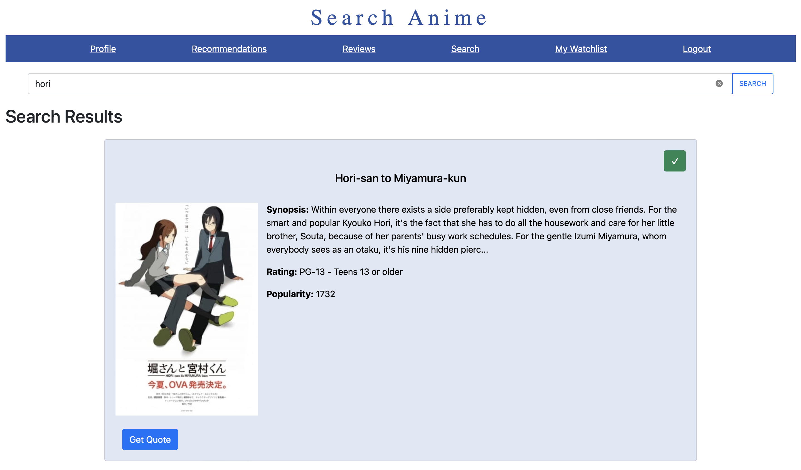

# AnimeWiki
**Project Description:** AnimeWiki is a Node.js web application created for anime lovers. It allows users to create an account, log in, browse/explore anime, write reviews, and create a watchlist. This web application was developed as part of a final group project for my Internet Programming class (CST336) alongside my teammates, [Melody Neely](https://github.com/Melodyncr), [Christopher Lendechy](https://github.com/ChristopherLendechy), and [Dylan Glo Ignacio](https://github.com/Dylan-Glo).
## Prerequisites
1. Make sure you have Node.js installed on your local computer
2. Need to have a MySQL database
## Project Setup
1. Fork this repo
2. Clone repo to your local computer
3. Access the app directory on your local computer through your terminal
4. Run `npm install` to install modules from package.json
## Database Setup
1. Go to your database to gather your information
2. Run SQL commands (located in the dbInfo folder) in your database (this will allow you to create the tables with prefilled data)
## File Setup
1. Open the index.js file on your computer and replace the environment variable at line 15 with a secret key (string) and lines 339, 340, 341, and 342 with your database info
## Instructions to Run
1. Access the app directory on your local computer through your terminal 
2. Within the directory, run `node index.js`
3. Go to a web browser and type `localhost:3000`
4. Finally, signup to create login credentials
## Web Application Images
### Login

### Profile

### Top Recommendations

### Search

### Reviews

### Watchlist
